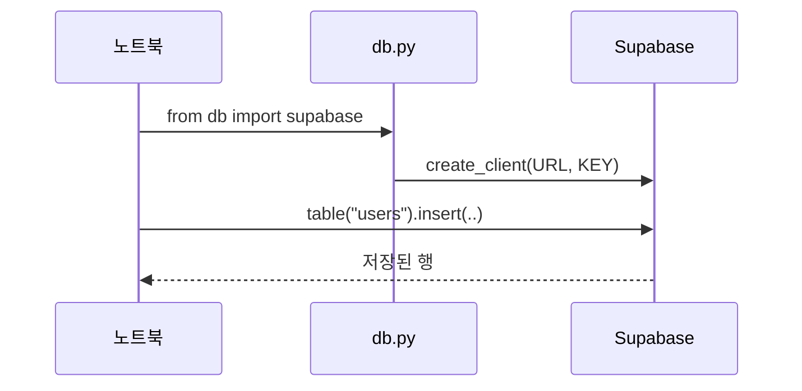

# Supabase 시작 — RDBMS 기초와 테이블 설계

> [!warning] 이용 조건
> 본 교육자료는 수강생 개인의 학습 목적에 한하여 이용할 수 있으며, 외부 AI 서비스에 업로드하거나 동영상을 포함한 2차 콘텐츠로 제작·재배포하는 행위를 금지합니다. 예외적 이용은 출처 표기, 비상업적 사용, 강사의 사전 동의를 모두 충족하는 경우에 한하여 허용됩니다.

> **교육생 배포용 실습 가이드**
> 이 문서 하나만 따라 하면 실습을 처음부터 끝까지 완성할 수 있습니다.
> 수업 중 놓친 부분이 있어도 이 문서로 혼자 복습할 수 있도록 모든 결과 코드를 포함했습니다.
>
> **코드 복사 방법 (Obsidian)** — `Ctrl + E`를 눌러 **읽기 모드**로 전환한 뒤, 코드 블록 위에 마우스를 올리면 우측 상단에 복사 버튼이 나타납니다. 편집 모드에서는 보이지 않습니다.

| 항목 | 내용 |
| --- | --- |
| 교육 일차 | **11일차** |
| 주제 | RDBMS·관계형 모델, ERD 설계, SQL 기초, Supabase 테이블 설계, 데이터 저장·조회 |
| 예제 도메인 | 챗봇 서비스 (사용자 / 대화 / 메시지) — 이후 과정에서 계속 사용합니다 |
| 소요 시간 | 이론 약 90분 + 실습 약 5시간 |
| 선수 조건 | 파이썬 기초, 구글 또는 GitHub 계정(Supabase 가입용) |
| 사용 도구 | 브라우저(Supabase SQL Editor), VS Code, 파이썬 |

---

## 0. 시작 전 체크리스트

실습을 시작하기 전에 아래를 확인합니다. 하나라도 안 되면 [11. 자주 나는 오류와 해결](#11-자주-나는-오류와-해결)을 먼저 보세요.

- [ ] 브라우저(Chrome 권장)를 쓸 수 있다
- [ ] 구글 계정 또는 GitHub 계정이 있다 (Supabase 가입에 씁니다)
- [ ] VS Code로 작업 폴더를 열 수 있다
- [ ] 터미널에서 `python --version` 실행 시 3.11 이상이 나온다

1절부터 5절까지는 **브라우저만** 있으면 됩니다. 파이썬 환경은 6절에서 처음 씁니다.

### 완료 후 산출물

실습이 끝나면 Supabase 프로젝트에 테이블 3개가 만들어지고, 로컬 폴더는 아래 모양이 됩니다.

```
1_supabase-basic-test/
├── .env                      ← 접속 정보 (직접 작성, 공유 금지)
├── .env.example              ← 작성용 템플릿
├── db.py                     ← Supabase 접속 코드
├── supabase_client.ipynb     ← 6절에서 채울 실습 노트북
├── pyproject.toml
└── sql/
    ├── 01_create_users.sql
    ├── 02_crud_practice.sql
    ├── 03_create_conversations.sql
    ├── 04_sample_data.sql
    ├── 05_join_practice.sql
    └── 99_cleanup.sql
```

Supabase에 만들어지는 테이블:

| 테이블 | 역할 |
| --- | --- |
| `users` | 사용자 정보 |
| `conversations` | 사용자별 대화 목록 (사용자 1명이 여러 개) |
| `messages` | 대화별 메시지 (대화 1개에 여러 개) |

---

## 1. 개념 이해 — 관계형 데이터베이스

### 관계형 데이터베이스란

데이터를 **테이블(표)** 로 저장하고, 테이블끼리 **관계**로 연결하는 데이터베이스입니다.

| 용어 | 의미 | 엑셀에 비유하면 |
| --- | --- | --- |
| 테이블(table) | 같은 형식의 데이터를 모아둔 표 | 시트 하나 |
| 행(row, 레코드) | 데이터 한 건 | 가로 한 줄 |
| 열(column, 컬럼) | 데이터의 항목 | 세로 한 칸 |
| 기본키(PK) | 행을 유일하게 구분하는 열 | 중복 없는 번호 |
| 외래키(FK) | 다른 테이블의 행을 가리키는 열 | 다른 시트를 참조하는 값 |

### 왜 테이블을 나누는가

한 테이블에 전부 담으면 같은 값이 계속 반복됩니다.

**잘못된 예 — 테이블 하나에 전부 담기**

| 사용자이메일 | 사용자닉네임 | 대화제목 | 메시지 |
| --- | --- | --- | --- |
| kim@example.com | 김철수 | 파이썬 기초 질문 | 리스트가 뭔가요 |
| kim@example.com | 김철수 | 파이썬 기초 질문 | 수정 가능한 목록입니다 |
| kim@example.com | 김철수 | 이직 고민 상담 | 이직해야 할까요 |

이 표에서는 세 가지 문제가 생깁니다. 각각 이름이 있고, 통틀어 **이상현상**이라 부릅니다.

| 이상현상 | 무엇을 하려 할 때 | 무슨 일이 생기나 |
| --- | --- | --- |
| **갱신 이상** | 닉네임 변경 | **3행을 다 고쳐야** 하고, 하나라도 빠뜨리면 같은 사람의 닉네임이 두 가지가 됩니다 |
| **삽입 이상** | 대화가 아직 없는 사용자 등록 | **넣을 자리가 없습니다.** 대화·메시지 칸을 비워야 하는데, 그러면 "대화가 없는 사람"인지 "제목을 못 정한 대화"인지 구분되지 않습니다 |
| **삭제 이상** | 마지막 대화 삭제 | **사용자 정보까지 사라집니다.** 이메일과 닉네임이 그 행에만 있었기 때문입니다 |

> **삽입 이상은 오늘 실제로 만납니다.** 4절 샘플 데이터의 **최지은은 대화가 하나도 없는 사용자**입니다. 위 표 형태였다면 최지은을 저장할 수 없습니다.

**올바른 예 — 테이블을 나누고 관계로 연결**

```
users                    conversations              messages
-----                    -------------              --------
id (PK)  ←──────────┐    id (PK)         ←────┐     id (PK)
email               └──  user_id (FK)         └──   conversation_id (FK)
username                 title                      role
created_at               created_at                 content
```

닉네임은 `users`에 **한 번만** 저장되므로, 고칠 곳도 한 곳입니다. 대화가 없는 사용자도 `users`에만 넣으면 되고, 대화를 지워도 사용자는 남습니다. **세 가지 이상현상이 모두 사라집니다.**

> **이렇게 표를 나누는 작업을 정규화(normalization)라고 합니다.** 오늘 만드는 세 테이블은 **제3정규형(3NF)** 을 만족합니다.
>
> 정규화 단계(1NF·2NF·3NF)와 판단 기준을 자세히 보려면 같은 폴더의 **`[배포용] 부록 - 데이터베이스 설계 심화`** 를 읽습니다. 수업 진도와 별개로 읽는 자료입니다.

### 관계의 종류

| 관계 | 의미 | 오늘의 예 |
| --- | --- | --- |
| 1:1 | 한 건이 한 건과만 연결 | (오늘 없음) |
| **1:N** | 한 건이 여러 건과 연결 | 사용자 1명 → 대화 여러 개 |
| N:M | 여러 건이 여러 건과 연결 | (오늘 없음) |

오늘 만드는 것은 전부 **1:N**입니다.

### ERD란

**ERD(Entity Relationship Diagram)** 는 테이블과 관계를 그림으로 나타낸 설계도입니다. 코드를 쓰기 전에 ERD로 구조를 먼저 정합니다.

ERD는 **두 단계**로 그립니다.

| | 논리 ERD | 물리 ERD |
| --- | --- | --- |
| 언제 | 요구사항을 정리한 직후 | 테이블을 만들기 직전 |
| 담는 것 | 무엇이 있고 어떻게 이어지는가 | + **데이터 타입**, PK/FK, 인덱스 |
| 이름 | 사람 말 (사용자, 대화) | DB 이름 (`users`, `conversations`) |

**같은 설계를 두 관점에서 그린 것**이고, 서로 어긋나면 안 됩니다.

**논리 ERD** — 오늘 1교시에 팀별로 그리는 것이 이것입니다.

```
사용자 ||──o< 대화 ||──o< 메시지

사용자          대화            메시지
  이메일          제목            역할
  닉네임                          내용
```

**물리 ERD** — 3~4교시에 `CREATE TABLE`로 만들 것입니다.

```
users ||──o< conversations ||──o< messages

users                      conversations              messages
  id          uuid   PK      id         uuid    PK      id               uuid   PK
  email       text   UK      user_id    uuid    FK      conversation_id  uuid   FK
  username    vc(30)         title      vc(100)         role             vc(20)
  created_at  tstz           created_at tstz            content          text
                                                        created_at       tstz
```

### 카디널리티

`||──o<` 표기를 **카디널리티(cardinality)** 라고 합니다. 관계의 양쪽에 몇 개가 올 수 있는지를 나타냅니다.

```
||     정확히 1개
o<     0개 이상       ← 오늘 쓰는 것
```

`users ||──o< conversations` 는 **"사용자 1명에 대화가 0개 이상"** 입니다.

> **`o`가 붙은 이유가 최지은입니다.** 대화가 하나도 없는 사용자가 있으므로 "1개 이상"이 아니라 "0개 이상"이어야 합니다. 여기를 잘못 잡으면 **가입 직후 사용자를 저장할 수 없는 설계**가 됩니다.

> 카디널리티 기호 전체와 논리·물리 ERD를 대조하는 방법은 **`[배포용] 부록 - 데이터베이스 설계 심화`** 에 있습니다.

### `username`은 무엇인가

사용자이름/username은 화면에 보이는 이름, 흔히 말하는 **닉네임**입니다. 로그인에 쓰는 아이디가 아닙니다 — 오늘은 로그인 기능 자체가 없습니다.

이름을 `username`으로 정한 데는 이유가 있습니다. **이후 과정에서 같은 이름을 계속 쓰기 때문입니다.**

|          | 오늘(11일차)과 다음 차수       | 그 이후                           |
| -------- | --------------------- | ------------------------------ |
| 계정을 담는 표 | `users` — 우리가 직접 만듭니다 | `auth.users` — Supabase가 관리합니다 |
| 이름을 담는 열 | `users.username`      | `profiles.username`            |

표는 바뀌지만 **열 이름은 그대로**입니다. 나중에 로그인을 붙일 때 무엇이 진짜 바뀌는지(누가 계정을 관리하는가)가 더 잘 보입니다.

---

## 2. Supabase 프로젝트 만들기

**Supabase**는 PostgreSQL 데이터베이스를 웹에서 바로 쓸 수 있게 해주는 서비스입니다. 서버 설치 없이 브라우저로 DB를 만들고 SQL을 실행할 수 있습니다.

### 2-1. 가입과 프로젝트 생성

1. 브라우저에서 [supabase.com](https://supabase.com) 접속 후 우측 상단 **Start your project** 클릭
2. **Continue with GitHub** 또는 구글 계정으로 로그인
3. **New project** 클릭
4. 아래 값을 입력합니다.

| 입력 항목 | 넣을 값 | 설명 |
| --- | --- | --- |
| Name | `chat-service` | 프로젝트 이름. 나중에 바꿀 수 있습니다 |
| Database Password | 직접 정한 비밀번호 | **반드시 따로 적어두세요.** 나중에 DB에 직접 접속할 때 씁니다 |
| Region | `Northeast Asia (Seoul)` 또는 `Northeast Asia (Tokyo)` | 가까울수록 응답이 빠릅니다 |

5. **Create new project** 클릭 후 1~2분 기다립니다. 초기화가 끝나면 대시보드가 나타납니다.

> **주의:** Database Password는 다시 볼 수 없습니다. 잊어버리면 Settings에서 재설정해야 합니다.

### 2-2. 대시보드 둘러보기

왼쪽 메뉴에서 오늘 쓰는 것은 두 개입니다.

| 메뉴 | 하는 일 | 오늘 쓰나 |
| --- | --- | --- |
| **Table Editor** | 테이블을 화면에서 보고 편집 | 결과 확인용으로 사용 |
| **SQL Editor** | SQL을 직접 입력해 실행 | **주로 여기서 실습** |
| Authentication | 회원가입·로그인 관리 | 이후 과정에서 사용 |
| Storage | 파일 저장 | 사용 안 함 |

### 2-3. SQL Editor 사용법

이후 모든 SQL 실습은 여기서 합니다. 절차를 한 번만 정리합니다.

1. 왼쪽 메뉴에서 **SQL Editor** 클릭
2. 좌측 상단 **New query** 클릭 (또는 기존 편집창 사용)
3. 편집창에 SQL을 붙여 넣습니다
4. 우측 하단 **Run** 버튼 클릭 (단축키 `Ctrl + Enter`)
5. 아래쪽 **Results** 영역에 결과 표 또는 `Success. No rows returned` 메시지가 나옵니다

> **참고:** 편집창에 여러 개의 SQL을 넣고 Run 하면 전부 순서대로 실행되고, **마지막 SELECT의 결과만** 화면에 표시됩니다. 하나씩 확인하려면 실행할 부분만 마우스로 드래그해 선택한 뒤 Run 합니다.

---

## 3. 실습 1부 — 테이블 만들기와 CRUD

여기서부터 SQL을 직접 실행합니다. 각 실습은 **목표 / 요구사항 / 힌트 / 결과 코드 / 확인** 순서입니다.

### 3-1. 제약 조건이란

테이블을 만들 때 "이 열에는 이런 값만 들어갈 수 있다"를 DB에 미리 알려주는 규칙입니다. 잘못된 데이터가 **저장되기 전에** 막힙니다.

| 제약 조건 | 의미 | 예 |
| --- | --- | --- |
| `PRIMARY KEY` | 행을 구분하는 열. 자동으로 중복 불가 + 빈 값 불가 | `id` |
| `NOT NULL` | 빈 값을 넣을 수 없음 | `email` |
| `UNIQUE` | 같은 값이 두 번 들어갈 수 없음 | `email` |
| `DEFAULT` | 값을 안 주면 자동으로 채워지는 값 | `created_at` |
| `CHECK` | 값이 조건을 만족해야 함 | 닉네임 2글자 이상 |
| `FOREIGN KEY` | 다른 테이블에 존재하는 값이어야 함 | `user_id` (4절에서 다룹니다) |

### 실습 1. users 테이블 만들기

**목표:** 제약 조건 다섯 가지를 넣어 사용자 테이블을 만든다.

**요구사항**

- 테이블 이름은 `users`
- `id`는 UUID이고 자동 생성되며 기본키
- `email`은 빈 값 불가, 중복 불가
- `username`은 최대 30자, 빈 값 불가, 2글자 이상만 허용
- `created_at`은 입력하지 않으면 현재 시각이 자동으로 들어감

**힌트**

- UUID 자동 생성: `default gen_random_uuid()`
- 현재 시각: `default now()`
- 글자 수 검사: `check (length(username) >= 2)`

**결과 코드**

```sql
create extension if not exists "pgcrypto";

create table users (
    id uuid primary key default gen_random_uuid(),
    email text not null unique,
    username varchar(30) not null check (length(username) >= 2),
    created_at timestamptz not null default now()
);
```

`create extension` 줄은 `gen_random_uuid()` 함수를 쓰기 위한 준비입니다. 이미 켜져 있으면 아무 일도 하지 않습니다.

> **주의 — 실행하면 확인 창이 뜹니다**
>
> Run을 누르면 아래 창이 나타나 실행이 멈춥니다.
>
> ```
> Potential issue detected
>
> This query creates a table without enabling Row Level Security.
> Clients using anon or authenticated keys may be able to access `users`.
>
>   [ Cancel ]   [ Run without RLS ]   [ Run and enable RLS ]
> ```
>
> **`Run without RLS`를 누릅니다.** RLS(행 단위 접근 제어)는 로그인 기능이 있어야 의미가 있어서 이후 과정에서 다룹니다. 오늘은 로그인이 없으므로 켤 수 없습니다.
> 실수로 `Run and enable RLS`를 눌러도 오늘 실습은 그대로 진행됩니다. 되돌리려면 `alter table users disable row level security;`를 실행합니다.

**확인:** SQL Editor에 아래를 붙여 넣고 Run 합니다. `id`, `email`, `username`, `created_at` 네 행이 나오고, `username`의 `is_nullable`이 `NO`로 표시됩니다.

```sql
select column_name, data_type, is_nullable, column_default
from information_schema.columns
where table_name = 'users' and table_schema = 'public'
order by ordinal_position;
```

**컬럼 설명을 DB에 저장합니다.** 위 `create table`의 `--` 주석은 **이 파일을 본 사람만** 볼 수 있습니다. `comment on`으로 넣으면 데이터베이스가 갖게 되어 Table Editor에도, 조회 쿼리에도 나옵니다.

```sql
comment on table  users            is '서비스 사용자';
comment on column users.id         is '사용자 식별자. 자동 생성되는 UUID';
comment on column users.email      is '로그인 이메일. 중복 불가';
comment on column users.username   is '화면에 보이는 이름. 로그인 아이디가 아니다';
comment on column users.created_at is '가입 시각. 입력하지 않으면 현재 시각';
```

이제 **컬럼 정의서**를 뽑습니다. 타입·길이·NULL 허용·기본값·설명이 한 번에 나옵니다.

```sql
select
    c.column_name              as 컬럼,
    c.data_type                as 타입,
    c.character_maximum_length as 길이,
    c.is_nullable              as null허용,
    c.column_default           as 기본값,
    col_description(('public.' || c.table_name)::regclass, c.ordinal_position) as 설명
from information_schema.columns c
where c.table_schema = 'public' and c.table_name = 'users'
order by c.ordinal_position;
```

```
컬럼        타입                       길이   null허용  기본값              설명
id          uuid                       NULL   NO        gen_random_uuid()   사용자 식별자. 자동 생성되는 UUID
email       text                       NULL   NO        NULL                로그인 이메일. 중복 불가
username    character varying          30     NO        NULL                화면에 보이는 이름. 로그인 아이디가 아니다
created_at  timestamp with time zone   NULL   NO        now()               가입 시각. 입력하지 않으면 현재 시각
```

> **타입 이름이 다르게 나옵니다.** `varchar(30)`으로 만들었는데 `character varying`, `timestamptz`는 `timestamp with time zone`으로 나옵니다. 뒤가 표준 이름이고 같은 타입입니다.

> **`comment on`을 실행하기 전에 이 쿼리를 돌려보면 `설명`이 전부 `NULL`입니다.** 순서를 바꿔 해보면 차이가 분명합니다.

> **정의서를 엑셀로 따로 관리하지 않습니다.** 컬럼을 추가하고 표를 안 고치는 일이 반드시 생깁니다. DB에서 뽑으면 항상 최신입니다.

---

### 실습 2. 데이터 넣기 & 제약 조건이 실제로 막는지 확인하기

**목표:** 일부러 규칙을 어겨 보고, 어떤 에러가 나는지 읽는다.

**요구사항**

- 아래 세 가지를 하나씩 실행해 에러 메시지를 확인한다
- **에러가 나는 것이 정상**이다

**결과 코드**

```sql
-- (1) NOT NULL 위반 — email 없이 넣기
insert into users (username) values ('테스터');

-- (2) CHECK 위반 — 닉네임이 1글자
insert into users (email, username) values ('x@example.com', 'A');

-- (3) 길이 초과 — varchar(30)을 넘김
insert into users (email, username) values ('y@example.com', repeat('가', 31));
```

**확인:** 각각 아래 메시지가 `Results` 영역에 빨간색으로 나옵니다.

| 실행한 것 | 나오는 메시지 |
| --- | --- |
| (1) | `null value in column "email" of relation "users" violates not-null constraint` |
| (2) | `new row for relation "users" violates check constraint "users_username_check"` |
| (3) | `value too long for type character varying(30)` |

메시지에 **어떤 제약 조건이 막았는지**가 그대로 적혀 있습니다. 앞으로 에러가 나면 이 부분을 먼저 읽습니다.

---

### 실습 3. 데이터 넣고 조회하기

**목표:** `INSERT`로 5건을 넣고 `SELECT`로 여러 방식으로 꺼낸다.

**요구사항**

- 사용자 5명을 한 번에 넣는다
- `id`와 `created_at`은 적지 않는다 (자동으로 채워짐)
- 전체 조회, 조건 조회, 정렬, 개수 제한을 각각 해본다

**힌트**

- 여러 건을 한 번에 넣을 때는 `values` 뒤에 괄호를 쉼표로 이어 씁니다
- 정렬은 `order by 열 desc`(내림차순) / `asc`(오름차순)

**결과 코드**

```sql
insert into users (email, username) values
    ('kim@example.com',  '김철수'),
    ('lee@example.com',  '이영희'),
    ('park@example.com', '박민수'),
    ('choi@example.com', '최지은'),
    ('jung@example.com', '정하늘');

-- 전체 조회
select id, email, username, created_at from users;

-- 조건 조회
select id, email, username from users
where email = 'kim@example.com';

-- 부분 일치 (이메일에 e가 들어간 사용자)
select email, username from users
where email like '%e%';

-- 정렬 (최신 가입 순)
select username, created_at from users
order by created_at desc;

-- 개수 제한 (먼저 가입한 3명)
select username, created_at from users
order by created_at asc
limit 3;

-- 개수 세기
select count(*) as 전체사용자수 from users;
```

**확인:** 첫 `insert` 실행 후 `Success. No rows returned`가 나옵니다. `select count(*)` 결과가 `5`입니다. 조건 조회는 1행, `limit 3`은 3행이 나옵니다.

> **참고:** 실무에서는 `select *` 대신 필요한 열만 적는 습관을 들입니다. 쓰지 않는 데이터까지 가져오면 느려집니다.

---

### 실습 4. UPDATE로 값 바꾸기

**목표:** 특정 사용자 한 명의 닉네임만 바꾼다.

**요구사항**

- `kim@example.com`의 닉네임을 `김철수리`로 바꾼다
- 한 행만 바뀌었는지 확인한다

**결과 코드**

```sql
update users
set username = '김철수리'
where email = 'kim@example.com';

select email, username from users order by email;
```

**확인:** `Results`에 5행이 나오고 `kim@example.com`의 닉네임만 `김철수리`입니다. 나머지 네 명은 그대로입니다.

---

### 실습 5. WHERE 없는 UPDATE — 직접 사고를 내본다

**목표:** 조건을 빠뜨린 `UPDATE`가 무슨 일을 하는지 직접 겪고, 예방법을 익힌다.

실무에서 가장 자주, 가장 크게 터지는 사고입니다. 말로 듣는 것과 직접 겪는 것은 다릅니다.

**요구사항**

- 사고를 내기 전에 백업 테이블을 만든다
- `where`를 빼고 `update`를 실행한다
- 피해를 확인하고 백업에서 복구한다
- 트랜잭션으로 예방하는 방법을 익힌다

**힌트**

- 백업: `create table 새이름 as select * from 원본;`
- 복구: 백업 테이블과 `id`를 맞춰 되돌립니다

**결과 코드**

```sql
-- (1) 사고 치기 전에 백업부터
create table users_backup as select * from users;

select count(*) as 백업건수 from users_backup;

-- (2) 사고 재현 — where 없이 update
update users
set username = '해킹당함';

-- (3) 피해 확인
select email, username from users order by email;

-- (4) 복구
update users u
set username = b.username
from users_backup b
where u.id = b.id;

select email, username from users order by email;
```

**확인:**
(2)를 실행하면 `Results`에 `Success`가 뜹니다. 에러가 아닙니다. **DB는 시킨 대로 했을 뿐입니다.**
(3)에서 **5명 전원의 닉네임이 `해킹당함`** 으로 바뀐 것을 봅니다.
(4) 실행 후 다시 `김철수리`, `이영희`, `박민수`, `최지은`, `정하늘`로 돌아옵니다.

(3)을 본 상태에서 스스로 물어봅니다.

- `Ctrl + Z`가 있는가 — **없습니다.** 이미 반영된 상태입니다.
- 원래 닉네임을 기억하는가 — **백업이 없었다면 영영 알 수 없습니다.**

### 예방법 — 트랜잭션으로 미리 확인하기

`begin`으로 시작하면 `commit` 전까지는 되돌릴 수 있습니다. 아래를 **통째로 선택해서 한 번에** 실행합니다.

```sql
begin;

update users set username = '실수다';

-- 몇 행이 바뀌었는지 여기서 확인한다. 예상과 다르면 rollback.
select count(*) as 바뀐행수 from users where username = '실수다';

rollback;   -- 되돌리기 (의도한 결과였다면 commit;)

select email, username from users order by email;
```

**확인:** `바뀐행수`가 `5`로 나옵니다. `rollback` 후 마지막 조회에서 닉네임이 원래대로입니다.

> **가장 중요한 습관 세 가지**
> 1. `UPDATE`/`DELETE` 전에 **같은 `WHERE`로 `SELECT`를 먼저** 실행해 대상을 확인합니다
> 2. 영향 행 수가 예상과 맞는지 봅니다
> 3. 확신이 없으면 `begin ... rollback`으로 감쌉니다

---

### 실습 6. DELETE로 삭제하기

**목표:** 탈퇴 사용자를 지운다. 지우기 전에 대상을 먼저 확인한다.

**요구사항**

- `jung@example.com`을 삭제한다
- 삭제 전에 `SELECT`로 대상을 확인한다
- 실습용 백업 테이블도 정리한다

**결과 코드**

```sql
-- (1) 지울 대상을 먼저 확인 (위 습관 1번)
select * from users where email = 'jung@example.com';

-- (2) 확인한 그 where 그대로 delete
delete from users
where email = 'jung@example.com';

select email, username from users order by email;

-- (3) 백업 테이블 정리
drop table users_backup;
```

**확인:** (1)에서 1행이 나옵니다. (2) 실행 후 조회하면 **4행**이 남고 `jung@example.com`이 없습니다.

> **주의:** 이후 실습은 사용자가 **4명**인 상태를 기준으로 합니다.

---

## 4. 실습 2부 — 관계 만들기 (외래키)

### 4-1. 외래키와 CASCADE

**외래키(FOREIGN KEY)** 는 "이 값은 반드시 저쪽 테이블에 있는 값이어야 한다"는 규칙입니다. 없는 사용자의 대화가 만들어지는 것을 DB가 막아줍니다.

**ON DELETE CASCADE** 는 부모 행이 지워질 때 자식 행도 함께 지우는 설정입니다.

| 설정 | 사용자를 삭제하면 |
| --- | --- |
| `on delete cascade` | 그 사용자의 대화·메시지도 함께 삭제됨 |
| 설정 없음(기본) | 대화가 남아 있으면 **삭제 자체가 거부됨** (FK 위반 에러) |

### 실습 7. conversations와 messages 만들기

**목표:** 외래키로 연결된 테이블 두 개를 만든다.

**요구사항**

- `conversations`: `user_id`가 `users.id`를 가리키고, 사용자 삭제 시 함께 삭제
- `messages`: `conversation_id`가 `conversations.id`를 가리키고, 대화 삭제 시 함께 삭제
- `role`은 `user` 또는 `assistant`만 허용
- 외래키 열에 인덱스를 만든다

**힌트**

- 외래키: `references 대상테이블(대상열) on delete cascade`
- 값 제한: `check (role in ('user', 'assistant'))`
- 인덱스: `create index 이름 on 테이블(열);`

**결과 코드**

```sql
create table conversations (
    id uuid primary key default gen_random_uuid(),
    user_id uuid not null references users(id) on delete cascade,
    title varchar(100) not null,
    created_at timestamptz not null default now()
);

create index idx_conversations_user_id on conversations(user_id);

create table messages (
    id uuid primary key default gen_random_uuid(),
    conversation_id uuid not null references conversations(id) on delete cascade,
    role varchar(20) not null check (role in ('user', 'assistant')),
    content text not null,
    created_at timestamptz not null default now()
);

create index idx_messages_conversation_id on messages(conversation_id);
```

`Run without RLS` 확인 창이 다시 뜹니다. 실습 1과 동일하게 처리합니다.

**인덱스를 만드는 이유:** "특정 사용자의 대화 목록"을 조회할 때(`where user_id = ...`) 훨씬 빨라집니다. 외래키 열에는 인덱스를 만들어두는 것이 관례입니다.

**확인:** 아래를 실행하면 2행이 나옵니다. `삭제규칙` 열이 둘 다 `CASCADE`입니다.

```sql
select
    tc.table_name    as 테이블,
    kcu.column_name  as 컬럼,
    ccu.table_name   as 참조테이블,
    rc.delete_rule   as 삭제규칙
from information_schema.table_constraints tc
join information_schema.key_column_usage kcu
    on tc.constraint_name = kcu.constraint_name
join information_schema.constraint_column_usage ccu
    on tc.constraint_name = ccu.constraint_name
join information_schema.referential_constraints rc
    on tc.constraint_name = rc.constraint_name
where tc.constraint_type = 'FOREIGN KEY'
  and tc.table_schema = 'public'
  and tc.table_name in ('conversations', 'messages');
```

```
테이블          컬럼              참조테이블       삭제규칙
conversations   user_id           users            CASCADE
messages        conversation_id   conversations    CASCADE
```

> **이 결과가 물리 ERD의 관계 부분입니다.** 1교시에 팀별로 그린 **논리 ERD의 관계 두 개**와 같은지 대조합니다. 손으로 그린 것과 실제가 어긋나는 일이 흔하므로, 만든 뒤에 확인합니다.
>
> `CASCADE`는 논리 ERD에 없던 정보입니다. **물리 단계에서 정해지는 것**입니다.

두 테이블에도 설명을 넣습니다.

```sql
comment on table  conversations            is '사용자별 대화';
comment on column conversations.id         is '대화 식별자';
comment on column conversations.user_id    is '대화 주인. users.id 참조. 사용자가 지워지면 함께 삭제';
comment on column conversations.title      is '대화 제목';
comment on column conversations.created_at is '대화 시작 시각';

comment on table  messages                 is '대화에 속한 메시지';
comment on column messages.id              is '메시지 식별자';
comment on column messages.conversation_id is '소속 대화. conversations.id 참조';
comment on column messages.role            is '작성 주체. user 또는 assistant';
comment on column messages.content         is '메시지 본문';
comment on column messages.created_at      is '작성 시각. 대화 순서를 이 값으로 정렬';
```

세 테이블 정의서를 한 번에 뽑으면 **13행**이 나옵니다.

```sql
select
    c.table_name               as 테이블,
    c.column_name              as 컬럼,
    c.data_type                as 타입,
    c.is_nullable              as null허용,
    col_description(('public.' || c.table_name)::regclass, c.ordinal_position) as 설명
from information_schema.columns c
where c.table_schema = 'public'
  and c.table_name in ('users', 'conversations', 'messages')
order by c.table_name, c.ordinal_position;
```

---

### 실습 8. 외래키가 실제로 막는지 확인하기

**목표:** 존재하지 않는 사용자의 대화를 만들어 본다.

**결과 코드**

```sql
insert into conversations (user_id, title)
values ('00000000-0000-0000-0000-000000000000', '유령 사용자의 대화');
```

**확인:** 아래 에러가 나옵니다.

```
insert or update on table "conversations" violates foreign key constraint "conversations_user_id_fkey"
```

외래키가 없었다면 이 "주인 없는 대화"가 그대로 저장됐을 것입니다.

---

### 실습 9. 조회용 샘플 데이터 넣기

**목표:** 5절 조회 실습에 쓸 데이터를 만든다.

**요구사항**

- 대화 4건, 메시지 9건을 넣는다
- `user_id`는 값을 직접 쓰지 않고 서브쿼리로 찾아 넣는다
- 최지은에게는 대화를 만들지 않는다 (5절 실습용)
- '여행 계획 짜기' 대화에는 메시지를 넣지 않는다 (5절 실습용)

**힌트**

`id`는 UUID라 실행할 때마다 값이 달라집니다. 그래서 값을 적어 넣을 수 없고, `select`로 찾아서 넣습니다.

```sql
(select id from users where email = 'kim@example.com')
```

**결과 코드**

```sql
insert into conversations (user_id, title) values
    ((select id from users where email = 'kim@example.com'),  '파이썬 기초 질문'),
    ((select id from users where email = 'kim@example.com'),  '이직 고민 상담'),
    ((select id from users where email = 'lee@example.com'),  'SQL 공부 방법'),
    ((select id from users where email = 'park@example.com'), '여행 계획 짜기');

insert into messages (conversation_id, role, content, created_at) values
    ((select id from conversations where title = '파이썬 기초 질문'), 'user',
     '리스트와 튜플의 차이가 뭔가요?',                    now() - interval '50 minutes'),
    ((select id from conversations where title = '파이썬 기초 질문'), 'assistant',
     '리스트는 수정할 수 있고 튜플은 수정할 수 없습니다.',  now() - interval '49 minutes'),
    ((select id from conversations where title = '파이썬 기초 질문'), 'user',
     '그럼 언제 튜플을 쓰나요?',                          now() - interval '48 minutes'),
    ((select id from conversations where title = '파이썬 기초 질문'), 'assistant',
     '값이 바뀌면 안 되는 좌표나 설정값에 씁니다.',         now() - interval '47 minutes'),

    ((select id from conversations where title = '이직 고민 상담'), 'user',
     '3년차인데 이직하는 게 좋을까요?',                    now() - interval '30 minutes'),
    ((select id from conversations where title = '이직 고민 상담'), 'assistant',
     '현재 직무에서 더 배울 것이 남았는지 먼저 점검해보세요.', now() - interval '29 minutes'),

    ((select id from conversations where title = 'SQL 공부 방법'), 'user',
     'JOIN이 너무 어려워요.',                             now() - interval '20 minutes'),
    ((select id from conversations where title = 'SQL 공부 방법'), 'assistant',
     '두 표를 나란히 놓고 어떤 열이 같은지부터 찾아보세요.',  now() - interval '19 minutes'),
    ((select id from conversations where title = 'SQL 공부 방법'), 'user',
     'LEFT JOIN은 언제 쓰나요?',                          now() - interval '18 minutes');
```

`now() - interval '50 minutes'`는 "지금부터 50분 전"이라는 뜻입니다. 메시지마다 시각을 다르게 줘서 대화 순서가 보이게 합니다.

**확인:** 아래를 실행하면 `사용자수 4`, `대화수 4`, `메시지수 9`가 한 행으로 나옵니다.

```sql
select
    (select count(*) from users)         as 사용자수,
    (select count(*) from conversations) as 대화수,
    (select count(*) from messages)      as 메시지수;
```

---

## 5. 실습 3부 — JOIN으로 테이블 연결

### 5-1. JOIN이 필요한 이유

`conversations`만 조회하면 누구의 대화인지 알 수 없습니다.

```sql
select id, user_id, title from conversations;
```

`user_id` 자리에 `a3f9c2e1-...` 같은 UUID만 보입니다. 사람 이름을 보려면 `users`를 함께 봐야 합니다. 이것이 JOIN입니다.

### 5-2. INNER JOIN과 LEFT JOIN

| 종류 | 남는 행 | 언제 쓰나 |
| --- | --- | --- |
| `INNER JOIN` (그냥 `join`) | 양쪽에 **모두 있는** 행만 | "대화가 있는 사용자만" |
| `LEFT JOIN` | 왼쪽은 **전부** 남기고, 짝이 없으면 `NULL` | "모든 사용자를, 대화가 없으면 없는 대로" |

최지은은 대화가 하나도 없으므로, 두 방식의 결과가 달라집니다.

### 실습 10. INNER JOIN과 LEFT JOIN 비교

**목표:** 같은 데이터에 두 방식을 적용해 결과 행 수 차이를 확인한다.

**결과 코드**

```sql
-- INNER JOIN — 최지은이 사라진다
select u.username, c.title
from users u
join conversations c on c.user_id = u.id
order by u.username;

-- LEFT JOIN — 최지은도 남고, title 자리에 NULL이 찍힌다
select u.username, c.title
from users u
left join conversations c on c.user_id = u.id
order by u.username;
```

**확인:** 첫 번째는 **4행**(김철수리 2건, 박민수 1건, 이영희 1건), 두 번째는 **5행**입니다. 두 번째 결과에 `최지은 | NULL` 행이 추가됩니다.

---

### 실습 11. 대화가 없는 사용자 찾기

**목표:** LEFT JOIN과 `IS NULL`을 조합해 "짝이 없는 행"만 골라낸다.

**결과 코드**

```sql
select u.username, u.email
from users u
left join conversations c on c.user_id = u.id
where c.id is null;
```

**확인:** `최지은 | choi@example.com` 한 행만 나옵니다.

---

### 실습 12. 사용자별 대화 수 세기

**목표:** 집계를 하면서, 개수를 세는 두 방법의 차이를 확인한다.

**요구사항**

- 대화가 없는 사용자는 `0`으로 나와야 한다
- `count(*)`와 `count(열)`의 결과를 나란히 비교한다

**힌트**

`count(*)`는 행의 개수를 셉니다. `count(열)`은 그 열이 `NULL`인 행은 세지 않습니다.

**결과 코드**

```sql
select
    u.username,
    count(*)     as 잘못된_대화수,
    count(c.id)  as 올바른_대화수
from users u
left join conversations c on c.user_id = u.id
group by u.username
order by u.username;
```

**확인:** 최지은 행에서 `잘못된_대화수`는 **1**, `올바른_대화수`는 **0**입니다.

LEFT JOIN 결과에서 최지은은 `title`이 `NULL`인 행 **한 줄로 남아 있기 때문에** `count(*)`가 1을 셉니다. `count(c.id)`는 `c.id`가 `NULL`이므로 세지 않아 0이 나옵니다.

> **가장 많이 틀리는 부분 — LEFT JOIN 뒤의 `count(*)`**
> 집계에서 0을 0으로 세려면 반드시 `count(열)` 형태를 씁니다.

---

### 실습 13. 세 테이블을 잇기

**목표:** 사용자 → 대화 → 메시지를 한 번에 조회한다.

**요구사항**

- 특정 대화의 메시지를 시간순으로 조회한다
- 메시지가 0건인 대화도 목록에 남게 한다

**결과 코드**

```sql
-- 특정 대화의 메시지 전체 (대화 흐름 그대로)
select
    m.role,
    m.content,
    m.created_at
from messages m
join conversations c on c.id = m.conversation_id
where c.title = '파이썬 기초 질문'
order by m.created_at;

-- 대화별 메시지 수 (메시지가 0건인 대화도 보이게)
select
    u.username,
    c.title,
    count(m.id) as 메시지수
from users u
join conversations c on c.user_id = u.id
left join messages m  on m.conversation_id = c.id
group by u.username, c.title
order by 메시지수 desc;
```

**확인:** 첫 번째는 4행이 시간순(`user` → `assistant` → `user` → `assistant`)으로 나옵니다.
두 번째는 4행이 나오고 `여행 계획 짜기`의 `메시지수`가 **0**입니다. 세 번째 JOIN만 `left join`인 것에 주목합니다.

---

### 실습 14. 서브쿼리

**목표:** SELECT 안에 SELECT를 넣어 같은 질문을 다른 방법으로 푼다.

**결과 코드**

```sql
-- 대화를 가진 사용자만 (실습 11과 반대 결과)
select username, email
from users
where id in (select user_id from conversations);

-- 사용자별 대화 수를 한 열로 (실습 12의 다른 방법)
select
    username,
    (select count(*) from conversations c where c.user_id = u.id) as 대화수
from users u
order by 대화수 desc;

-- 가장 최근 대화가 있는 사용자 목록
select
    u.username,
    max(c.created_at) as 최근대화시각
from users u
join conversations c on c.user_id = u.id
group by u.username
order by 최근대화시각 desc;
```

**확인:** 첫 번째는 3행(최지은 제외), 두 번째는 4행이고 최지은의 `대화수`가 `0`입니다.

> **참고:** 서브쿼리 방식은 읽기 쉽지만, 행마다 다시 조회가 돌아 데이터가 많아지면 느려집니다. 같은 질문을 JOIN으로도 서브쿼리로도 풀 수 있다는 것을 아는 것이 목표입니다.

---

## 6. 실습 4부 — 파이썬으로 저장·조회하기

**흐름을 그림으로 보면 이렇습니다.**



**접속을 `db.py`에 모아두고 실습 노트북은 가져다 쓰기만 합니다.** 12일차 FastAPI의 `app/db.py`도 같은 구조입니다.

지금까지 브라우저에서 하던 일을 파이썬 코드로 해봅니다. 다음 단계에서 만들 FastAPI 서버도 여기서 쓰는 방식 그대로 데이터베이스에 접근합니다.

### 6-1. 파이썬 개발 환경 만들기

**uv**는 파이썬 가상환경과 패키지를 함께 관리하는 도구입니다. 가상환경을 만들고 패키지를 설치하는 두 단계를 한 번에 처리합니다.

**1단계 — uv 설치** (이미 설치돼 있으면 건너뜁니다)

셋 중 되는 방법 하나로 설치합니다.

```powershell
pip install uv
```

```powershell
winget install --id=astral-sh.uv -e
```

```powershell
powershell -ExecutionPolicy ByPass -c "irm https://astral.sh/uv/install.ps1 | iex"
```

설치 후 **터미널 창을 새로 엽니다.** 창을 새로 열지 않으면 `uv를 찾을 수 없습니다`가 나옵니다. 확인:

```powershell
uv --version
```

**2단계 — 가상환경과 패키지 설치**

```powershell
cd 1_supabase-basic-test
uv sync
```

이 한 줄로 `.venv` 폴더가 만들어지고 `supabase`, `python-dotenv` 패키지가 설치됩니다.

| 명령 | 하는 일 |
| --- | --- |
| `uv sync` | `pyproject.toml`을 읽어 가상환경 생성 + 패키지 설치 |
| `uv add 패키지` | 패키지 추가 (`pip install` 대신) |
| `uv run python 파일.py` | 가상환경의 파이썬으로 실행 (활성화 불필요) |

> **주의:** uv가 만든 `.venv`에는 `pip`이 들어 있지 않습니다. `python -m pip install`을 실행하면 `No module named pip` 에러가 나는데 정상입니다. 패키지는 `uv add`로 추가합니다.

uv를 설치하지 못했다면 기존 방식으로도 됩니다.

```powershell
python -m venv .venv
.venv\Scripts\Activate.ps1
pip install supabase python-dotenv
```

`Activate.ps1` 실행 시 `이 시스템에서 스크립트를 실행할 수 없으므로` 에러가 나면, 아래를 먼저 실행하고 다시 시도합니다. 지금 열린 창에서만 적용되므로 안전합니다.

```powershell
Set-ExecutionPolicy -Scope Process -ExecutionPolicy Bypass -Force
```

### 6-2. 접속 정보 준비하기

`.env`는 비밀번호나 API 키처럼 코드에 직접 쓰면 안 되는 값을 담는 파일입니다.

**1단계 — 파일 만들기**

```powershell
copy .env.example .env
```

**2단계 — 값 두 개 채우기**

Supabase 대시보드에서 값을 가져옵니다.

| 항목 | 대시보드 위치 |
| --- | --- |
| `SUPABASE_URL` | 왼쪽 아래 **Settings** → **API** → **Project URL** |
| `SUPABASE_SERVICE_ROLE_KEY` | 같은 화면 **Project API keys** → **`service_role`** (`secret` 표시가 붙은 쪽) |

`.env` 파일 내용:

```
SUPABASE_URL=https://xxxxxxxxxxxx.supabase.co
SUPABASE_SERVICE_ROLE_KEY=여기에_service_role_key_붙여넣기
```

> **주의 — service_role 키는 관리자 키입니다**
> 이 키는 접근 제어를 무시하고 모든 데이터를 읽고 쓸 수 있습니다. 서버 코드에서만 쓰고 **웹 화면이나 공개 저장소에 절대 넣지 않습니다.** `.env`는 `.gitignore`에 포함돼 있어 커밋되지 않습니다.
> 바로 옆의 `anon` 키는 공개용이라 성격이 다릅니다. 두 키의 차이는 이후 로그인 과정에서 다룹니다.

### 6-3. 접속 코드와 실습 코드를 나누는 이유

`db.py`에 접속 코드를 두고, 실습 파일은 그것을 가져다 씁니다.

```python
# db.py
import os

from dotenv import load_dotenv
from supabase import Client, create_client

load_dotenv()

SUPABASE_URL = os.environ["SUPABASE_URL"]
SUPABASE_SERVICE_ROLE_KEY = os.environ["SUPABASE_SERVICE_ROLE_KEY"]

supabase: Client = create_client(SUPABASE_URL, SUPABASE_SERVICE_ROLE_KEY)
```

| 이유 | 설명 |
| --- | --- |
| 한 곳에서 관리 | 키가 바뀌어도 `db.py`만 고치면 됩니다 |
| 재사용 | 실습 파일이 여러 개여도 같은 연결을 씁니다 |
| 구조 분리 | '설정'과 '로직'을 나누는 실무 방식입니다 |
| 다음 단계 연결 | **FastAPI 서버도 `app/db.py`로 똑같이 나눕니다** |

실습 파일에서는 이렇게 가져옵니다.

```python
from db import supabase as sb
```

### 6-4. 실습 파일 준비

`supabase_client.ipynb`를 열면 첫 코드 셀에 아래가 이미 들어 있습니다.

```python
import sys

# 접속 코드는 db.py 에 따로 두고 여기서는 가져다 쓰기만 한다.
from db import supabase

# 윈도우 터미널에서 한글이 깨지지 않게 한다.
sys.stdout.reconfigure(encoding="utf-8")
```

실행 방법:

```powershell
VS Code에서 supabase_client.ipynb 열기 → 커널로 .venv 선택 → 셀을 위에서부터 Shift + Enter
```

---

### 실습 15. 연결 확인과 데이터 넣기

**목표:** 파이썬에서 Supabase에 연결하고 사용자 1명을 추가한다.

**요구사항**

- 사용자 수를 세어 연결을 확인한다
- `sql_to_py@example.com` / `파이썬` 사용자를 추가한다
- 추가 후 DB가 만들어준 `id`를 변수에 담아둔다 (뒤에서 씁니다)

**힌트**

| SQL | 파이썬 |
| --- | --- |
| `select count(*) from users` | `supabase.table("users").select("*", count="exact").execute()` 후 `.count` |
| `insert into users (열...) values (...)` | `supabase.table("users").insert({"열": 값}).execute()` |

`insert()`에는 열 이름을 키로 하는 딕셔너리를 넘깁니다.

**결과 코드**

```python
# 연결 확인
result = supabase.table("users").select("*", count="exact").execute()


# 사용자 추가
result = supabase.table("users").insert({
    "email": "sql_to_py@example.com",
    "username": "파이썬",
}).execute()

new_user = result.data[0]
new_user_id = new_user["id"]     # DB 가 만들어준 id. 아래에서 쓴다.

print("추가된 사용자:", new_user)
```

**확인:** 터미널에 `users 테이블: 4 건`이 나온 뒤, 추가된 사용자의 `id`, `email`, `username`, `created_at`이 딕셔너리로 출력됩니다.

---

### 실습 16. 조회하기

**목표:** SQL의 `SELECT`에 해당하는 조회를 세 가지 방식으로 한다.

**요구사항**

- 전체 조회, 조건 조회, 정렬 + 개수 제한

**힌트**

| SQL | 파이썬 |
| --- | --- |
| `where 열 = 값` | `.eq("열", 값)` |
| `order by 열 desc` | `.order("열", desc=True)` |
| `limit 3` | `.limit(3)` |

**결과 코드**

```python
# 전체 조회
result = supabase.table("users").select("username, email").execute()
print("전체 목록:")
for user in result.data:
    print("   ", user["username"], "|", user["email"])

# 조건 조회
result = supabase.table("users").select("*").eq("email", "sql_to_py@example.com").execute()
print("조건으로 찾기:", result.data)

# 정렬 + 개수 제한
result = supabase.table("users").select("username").order("created_at", desc=True).limit(3).execute()
print("최근 가입 3명:")
for user in result.data:
    print("   ", user["username"])
```

**확인:** 전체 목록에 5명(기존 4명 + 방금 추가한 1명)이 한 줄씩 나옵니다. 조건 조회는 1건, 최근 가입은 3명이 나옵니다.

---

### 실습 17. 외래키가 있는 데이터 넣기

**목표:** 대화와 메시지를 만든다. SQL에서 서브쿼리로 찾던 `user_id`를 파이썬 변수로 대신한다.

**요구사항**

- 실습 15에서 받아둔 `new_user_id`로 대화 1건을 만든다
- 메시지 2건을 한 번에 넣는다

**힌트**

여러 건을 한 번에 넣을 때는 딕셔너리의 **리스트**를 넘깁니다.

**결과 코드**

```python
# 대화 1건
result = supabase.table("conversations").insert({
    "user_id": new_user_id,
    "title": "파이썬으로 만든 대화",
}).execute()

conversation_id = result.data[0]["id"]
print("대화 생성:", result.data[0]["title"])

# 메시지 2건을 한 번에. 여러 건은 리스트로 넘긴다.
result = supabase.table("messages").insert([
    {"conversation_id": conversation_id, "role": "user", "content": "파이썬에서도 저장이 되나요?"},
    {"conversation_id": conversation_id, "role": "assistant", "content": "네, 방금 저장됐습니다."},
]).execute()

print("메시지", len(result.data), "건 저장")
```

**확인:** `대화 생성: 파이썬으로 만든 대화`와 `메시지 2 건 저장`이 출력됩니다.

SQL에서는 `(select id from users where email = ...)`로 찾아 넣었지만, 파이썬에서는 앞에서 받아둔 변수를 그대로 씁니다. 이쪽이 더 직관적입니다.

---

### 실습 18. 관계 조회 (SQL의 JOIN에 해당)

**목표:** 5절에서 SQL로 하던 JOIN을 파이썬에서 표현한다.

**요구사항**

- 사용자와 대화를 함께 조회한다
- INNER JOIN에 해당하는 방식도 해본다
- 사용자 → 대화 → 메시지를 3단계로 중첩해 조회한다

**힌트**

`select()` 안에 관계를 **중첩해서** 적습니다.

| SQL | 파이썬 |
| --- | --- |
| `left join conversations` | `select("username, conversations(title)")` |
| `join conversations` (INNER) | `select("username, conversations!inner(title)")` |

**결과 코드**

```python
# LEFT JOIN 에 해당
result = supabase.table("users").select("username, conversations(title)").execute()

for user in result.data:
    print(" ", user["username"])
    if len(user["conversations"]) == 0:
        print("     (대화 없음)")
    for conversation in user["conversations"]:
        print("    -", conversation["title"])

# INNER JOIN 에 해당
result = supabase.table("users").select("username, conversations!inner(title)").execute()
print("!inner 를 쓰면:")
for user in result.data:
    print("   ", user["username"])

# 3단계 중첩
result = (
    supabase.table("users")
    .select("username, conversations(title, messages(role, content))")
    .eq("email", "sql_to_py@example.com")
    .execute()
)

for user in result.data:
    for conversation in user["conversations"]:
        print(" ", user["username"], "-", conversation["title"])
        for message in conversation["messages"]:
            print("    ", message["role"], ":", message["content"])
```

**확인:** 첫 번째 출력에서 **최지은 아래에 `(대화 없음)`** 이 나옵니다.

```
  김철수리
    - 파이썬 기초 질문
    - 이직 고민 상담
  이영희
    - SQL 공부 방법
  박민수
    - 여행 계획 짜기
  최지은
     (대화 없음)
  파이썬
    - 파이썬으로 만든 대화
```

대화가 없으면 빈 리스트가 오기 때문이며, **SQL의 LEFT JOIN과 같은 동작**입니다.
`!inner` 를 쓴 두 번째 출력에는 최지은이 빠집니다.
세 번째는 방금 만든 대화와 메시지 2건이 들여쓰기되어 나옵니다.

---

### 실습 19. 수정·삭제와 조건 없는 UPDATE

**목표:** 값을 바꾸고 지운다. 조건 없는 `UPDATE`가 파이썬에서는 어떻게 되는지 확인한다.

**요구사항**

- 방금 만든 사용자의 닉네임을 `파이썬고수`로 바꾼다
- 조건 없이 `update`를 시도해본다
- 사용자를 삭제하고, 대화·메시지가 어떻게 되는지 확인한다

**결과 코드**

```python
# 수정
result = supabase.table("users").update({"username": "파이썬고수"}).eq("id", new_user_id).execute()
print("수정 결과:", result.data[0]["username"])

# 조건 없이 수정을 시도한다. 어떻게 되는지 본다.
print("조건 없이 수정을 시도하면:")
try:
    supabase.table("users").update({"username": "전체덮어쓰기"}).execute()
    print("   실행됐다")
except Exception as error:
    print("   차단됐다:", type(error).__name__)

# 삭제. 대화와 메시지는 CASCADE 로 함께 사라진다.
supabase.table("users").delete().eq("id", new_user_id).execute()

result = supabase.table("users").select("*", count="exact").execute()
print("삭제 후 users:", result.count, "건")

result = supabase.table("conversations").select("*", count="exact").execute()
print("conversations:", result.count, "건")
```

**확인:**

```
수정 결과: 파이썬고수

조건 없이 수정을 시도하면:
   차단됐다: APIError

삭제 후 users: 4 건
conversations: 4 건
```

실습 5에서 SQL로는 조건 없는 `UPDATE`가 그대로 실행돼 5명 전원이 덮어써졌지만, **이 라이브러리는 조건 없는 수정과 삭제를 아예 거부합니다.** 실수 방지 장치입니다.

마지막 두 줄은 사용자를 지우자 그 사용자의 대화도 `ON DELETE CASCADE`로 함께 사라진 결과입니다.

---

## 7. 전체 완성 코드

`supabase_client.ipynb`의 완성본입니다.

```python
"""6교시 - 파이썬으로 저장하고 조회하기

지금까지 브라우저(SQL Editor)에서 하던 것을 파이썬 코드로 해본다.
각 절에 대응하는 SQL 을 주석으로 적어뒀으니 대조하며 본다.

sql/ 의 01~04 를 실행해 테이블과 데이터가 있는 상태에서 진행한다.
실습에서 만든 것은 마지막 절에서 지우므로 5교시 실습 데이터는 그대로 남는다.

실행: VS Code에서 supabase_client.ipynb 열기 → 커널로 .venv 선택 → 셀을 위에서부터 Shift + Enter
"""

import sys

# 접속 코드는 db.py 에 따로 두고 여기서는 가져다 쓰기만 한다.
# 12일차 FastAPI 도 app/db.py 로 똑같이 나눈다.
from db import supabase

# 윈도우 터미널에서 한글이 깨지지 않게 한다.
sys.stdout.reconfigure(encoding="utf-8")


def title(text):
    print()
    print("=" * 55)
    print(text)
    print("=" * 55)


title("0. 연결 확인")

# SQL:  select count(*) from users;
result = supabase.table("users").select("*", count="exact").execute()
print("users 테이블:", result.count, "건")


title("1. 사용자 추가하기")

# SQL:  insert into users (email, username) values ('sql_to_py@example.com', '파이썬');
result = supabase.table("users").insert({
    "email": "sql_to_py@example.com",
    "username": "파이썬",
}).execute()

new_user = result.data[0]
new_user_id = new_user["id"]     # DB 가 만들어준 id. 아래에서 쓴다.

print("추가된 사용자:", new_user)


title("2. 조회하기")

# SQL:  select username, email from users;
result = supabase.table("users").select("username, email").execute()
print("전체 목록:")
for user in result.data:
    print("   ", user["username"], "|", user["email"])

# SQL:  select * from users where email = 'sql_to_py@example.com';
result = supabase.table("users").select("*").eq("email", "sql_to_py@example.com").execute()
print()
print("조건으로 찾기:", result.data)

# SQL:  select username from users order by created_at desc limit 3;
result = supabase.table("users").select("username").order("created_at", desc=True).limit(3).execute()
print()
print("최근 가입 3명:")
for user in result.data:
    print("   ", user["username"])


title("3. 대화와 메시지 추가하기")

# SQL 에서는 서브쿼리로 user_id 를 찾아 넣었지만,
# 파이썬에서는 1절에서 받아둔 변수를 그대로 쓰면 된다.
result = supabase.table("conversations").insert({
    "user_id": new_user_id,
    "title": "파이썬으로 만든 대화",
}).execute()

conversation_id = result.data[0]["id"]
print("대화 생성:", result.data[0]["title"])

# 여러 건을 한 번에 넣을 때는 리스트로 넘긴다.
result = supabase.table("messages").insert([
    {"conversation_id": conversation_id, "role": "user", "content": "파이썬에서도 저장이 되나요?"},
    {"conversation_id": conversation_id, "role": "assistant", "content": "네, 방금 저장됐습니다."},
]).execute()

print("메시지", len(result.data), "건 저장")


title("4. 관계 조회하기 (SQL 의 JOIN)")

# SQL:  select u.username, c.title
#       from users u left join conversations c on c.user_id = u.id;
#
# 파이썬에서는 select() 안에 관계를 중첩해서 적는다.
result = supabase.table("users").select("username, conversations(title)").execute()

for user in result.data:
    print(" ", user["username"])
    if len(user["conversations"]) == 0:
        print("     (대화 없음)")
    for conversation in user["conversations"]:
        print("    -", conversation["title"])

print()
print("대화가 없는 사용자는 빈 목록으로 나온다. LEFT JOIN 과 같은 동작이다.")

# 대화가 있는 사용자만 보려면 관계 이름 뒤에 !inner 를 붙인다. INNER JOIN 에 해당한다.
result = supabase.table("users").select("username, conversations!inner(title)").execute()
print()
print("!inner 를 쓰면:")
for user in result.data:
    print("   ", user["username"])


title("5. 3단계로 중첩해서 조회하기")

# users 안에 conversations, 그 안에 messages 까지 한 번에 가져온다.
result = (
    supabase.table("users")
    .select("username, conversations(title, messages(role, content))")
    .eq("email", "sql_to_py@example.com")
    .execute()
)

for user in result.data:
    for conversation in user["conversations"]:
        print(" ", user["username"], "-", conversation["title"])
        for message in conversation["messages"]:
            print("    ", message["role"], ":", message["content"])


title("6. 수정과 삭제")

# SQL:  update users set username = '파이썬고수' where id = ...;
result = supabase.table("users").update({"username": "파이썬고수"}).eq("id", new_user_id).execute()
print("수정 결과:", result.data[0]["username"])

# 3교시에서 WHERE 없이 UPDATE 해서 전원의 닉네임을 덮어썼던 것을 기억할 것.
# 아래는 조건 없이 수정을 시도한다. 어떻게 되는지 본다.
print()
print("조건 없이 수정을 시도하면:")
try:
    supabase.table("users").update({"username": "전체덮어쓰기"}).execute()
    print("   실행됐다")
except Exception as error:
    print("   차단됐다:", type(error).__name__)
    print("   이 라이브러리는 조건 없는 수정과 삭제를 아예 거부한다.")


title("7. 정리")

# 사용자를 지우면 대화와 메시지도 함께 지워진다 (4교시 ON DELETE CASCADE).
supabase.table("users").delete().eq("id", new_user_id).execute()

result = supabase.table("users").select("*", count="exact").execute()
print("삭제 후 users:", result.count, "건")

result = supabase.table("conversations").select("*", count="exact").execute()
print("conversations:", result.count, "건")

print()
print("사용자만 지웠는데 대화도 함께 사라졌다. DB 가 알아서 처리한 것이다.")
```

---

## 8. 마치기 전에 — 테이블은 남겨둡니다

**오늘 만든 `users`, `conversations`, `messages`는 지우지 않습니다.** 다음 차수에서 이 테이블에 웹 API를 씌우기 때문입니다.

실습용으로 만든 백업 테이블만 정리합니다. 실습 6에서 이미 지웠다면 아무 일도 일어나지 않습니다.

```sql
drop table if exists users_backup;
```

**확인:** 아래를 실행했을 때 `users`, `conversations`, `messages` **3행**이 나오고 `users_backup`은 없어야 합니다.

```sql
select table_name
from information_schema.tables
where table_schema = 'public'
  and table_name in ('users', 'conversations', 'messages', 'users_backup')
order by table_name;
```

데이터도 그대로 두고 마칩니다. 다음 차수 시작 시 `4 / 4 / 9`(사용자 / 대화 / 메시지)인 상태를 전제합니다.

```sql
select
    (select count(*) from users)         as 사용자수,
    (select count(*) from conversations) as 대화수,
    (select count(*) from messages)      as 메시지수;
```

---

## 9. 최종 확인 체크리스트

- [ ] Supabase 대시보드 **Table Editor**에서 `users`, `conversations`, `messages` 세 테이블이 보였다
- [ ] `insert into users ... values` 5건 실행 후 `select count(*) from users`가 `5`였다
- [ ] `where` 없는 `update` 실행 후 5명 전원의 닉네임이 `해킹당함`으로 바뀐 것을 직접 봤다
- [ ] 백업 테이블에서 복구해 원래 닉네임으로 돌아왔다
- [ ] `begin ... rollback`으로 변경을 되돌려봤다
- [ ] 존재하지 않는 사용자로 대화를 만들려 할 때 `violates foreign key constraint` 에러를 봤다
- [ ] `join`은 4행, `left join`은 5행이 나오는 것을 비교했다
- [ ] LEFT JOIN 뒤 `count(*)`가 `1`, `count(c.id)`가 `0`인 것을 확인했다
- [ ] `uv sync` 후 `.venv` 폴더가 만들어졌다
- [ ] `supabase_client.ipynb`의 연결 확인 셀에서 `users 테이블: 4 건`이 출력됐다
- [ ] 관계 조회에서 최지은 행에 `(대화 없음)`이 출력됐다
- [ ] 조건 없는 `update` 시도에서 `조건 없는 UPDATE 차단됨: APIError`가 출력됐다
- [ ] `comment on`으로 세 테이블의 컬럼 설명을 넣었고, 정의서 조회에서 `설명` 열이 채워졌다
- [ ] 외래키 조회가 **2행**이고, 1교시에 그린 논리 ERD의 관계와 일치했다
- [ ] `users_backup`을 정리하고, `users` / `conversations` / `messages` 세 테이블은 남겨뒀다
- [ ] 마지막 개수 확인이 `4 / 4 / 9`로 나왔다

---

## 10. 정리

오늘 익힌 것을 SQL과 파이썬으로 나란히 비교합니다.

| 하는 일 | SQL | 파이썬 (supabase) |
| --- | --- | --- |
| 전체 조회 | `select * from users` | `supabase.table("users").select("*").execute()` |
| 조건 조회 | `where email = '...'` | `.eq("email", "...")` |
| 부분 일치 | `where username like '%김%'` | `.like("username", "%김%")` |
| 정렬 | `order by created_at desc` | `.order("created_at", desc=True)` |
| 개수 제한 | `limit 3` | `.limit(3)` |
| 개수 세기 | `select count(*)` | `.select("*", count="exact")` 후 `.count` |
| 추가 | `insert into ... values ...` | `.insert({...})` |
| 여러 건 추가 | `values (...), (...)` | `.insert([{...}, {...}])` |
| 수정 | `update ... set ... where ...` | `.update({...}).eq(...)` |
| 삭제 | `delete from ... where ...` | `.delete().eq(...)` |
| LEFT JOIN | `left join conversations c on ...` | `.select("username, conversations(title)")` |
| INNER JOIN | `join conversations c on ...` | `.select("username, conversations!inner(title)")` |

**핵심 개념 정리**

- 표를 나누고 관계로 연결하면 같은 값을 한 곳에서만 관리할 수 있습니다
- 제약 조건은 잘못된 데이터가 **저장되기 전에** 막습니다
- `WHERE` 없는 `UPDATE`/`DELETE`는 전체 행에 적용됩니다. 되돌릴 수 없습니다
- INNER JOIN은 양쪽에 다 있는 행만, LEFT JOIN은 왼쪽을 전부 남깁니다
- 접속 코드와 실습 코드를 나누면 관리가 쉬워집니다. FastAPI 서버도 같은 구조입니다

**다음 시간 예고**

오늘 파이썬으로 직접 실행한 저장·조회를, 이번엔 **웹 API**로 만듭니다. 브라우저나 다른 프로그램이 주소를 호출하면 데이터베이스에서 값을 꺼내 돌려주는 FastAPI 서버를 작성합니다.

---

## 11. 자주 나는 오류와 해결

| 증상 | 원인 | 해결 |
| --- | --- | --- |
| `Potential issue detected` 창이 뜨고 실행이 안 됨 | RLS 없이 표를 만들 때 나오는 확인 창 | `Run without RLS` 클릭 |
| `relation "users" already exists` | 표가 이미 있는데 다시 만들려고 함 | 8절 정리 SQL을 먼저 실행한 뒤 다시 만듦 |
| `null value in column "email" violates not-null constraint` | 필수 열을 빼고 넣음 | `insert` 문에 해당 열과 값을 추가 |
| `duplicate key value violates unique constraint "users_email_key"` | 이미 있는 이메일을 또 넣음 | 다른 이메일로 바꾸거나, 기존 행을 먼저 삭제 |
| `violates check constraint "users_username_check"` | 닉네임이 2글자 미만 | 2글자 이상으로 수정 |
| `violates foreign key constraint` | 존재하지 않는 `user_id` 또는 `conversation_id` | `select id from users`로 실제 값을 확인해 사용 |
| `value too long for type character varying(30)` | 닉네임이 30자를 넘음 | 30자 이내로 수정 |
| 대화 목록에 최지은이 안 보임 | `join`(INNER)을 씀 | `left join`으로 변경 |
| 대화 없는 사용자의 개수가 `1`로 나옴 | `count(*)`를 씀 | `count(c.id)` 형태로 변경 |
| `uv를 찾을 수 없습니다` | 설치 후 터미널을 새로 열지 않음 | 터미널 창을 닫고 새로 연 뒤 `uv --version` |
| `No module named pip` | uv 가상환경에는 pip이 없음 | `uv add 패키지` 사용 |
| `Activate.ps1 ... 스크립트를 실행할 수 없으므로` | PowerShell 실행 정책 제한 | `Set-ExecutionPolicy -Scope Process -ExecutionPolicy Bypass -Force` 후 재시도 |
| `KeyError: 'SUPABASE_URL'` | `.env`가 없거나 값이 비어 있음 | `.env.example`을 복사해 `.env`를 만들고 값 두 개를 채움 |
| `ModuleNotFoundError: No module named 'db'` | 실행 위치가 `1_supabase-basic-test` 폴더가 아님 | `cd 1_supabase-basic-test` 후 실행 |
| `UnicodeEncodeError: 'cp949' codec can't encode` | 콘솔 인코딩 문제 | 파일 상단에 `sys.stdout.reconfigure(encoding="utf-8")` 확인. 그래도 깨지면 터미널에서 `chcp 65001` |
| 한글이 `???`로 보임 | 콘솔 코드페이지 | `chcp 65001` 실행 후 다시 실행. DB에는 정상 저장됨 |

---

## 12. 부록 — 용어 사전

| 용어 | 한 줄 정의 |
| --- | --- |
| RDBMS | 데이터를 표로 저장하고 표끼리 관계로 연결하는 데이터베이스 관리 시스템 |
| PostgreSQL | 오픈소스 RDBMS. Supabase가 내부적으로 사용 |
| Supabase | PostgreSQL을 웹에서 바로 쓸 수 있게 해주는 서비스 |
| 테이블(table) | 같은 형식의 데이터를 모아둔 표 |
| 행(row) | 데이터 한 건. 표의 가로 한 줄 |
| 열(column) | 데이터의 항목. 표의 세로 한 칸 |
| 기본키(PK) | 행을 유일하게 구분하는 열. 중복·빈 값 불가 |
| 외래키(FK) | 다른 표에 실제로 존재하는 값만 허용하는 열 |
| UUID | 중복되지 않는 긴 식별자. `a3f9c2e1-...` 형태 |
| `username` | 화면에 보이는 사용자 이름(닉네임). 로그인 아이디가 아님 |
| 정규화 | 이상현상이 생기지 않도록 표를 나누는 작업 |
| 이상현상 | 나누지 않은 표에서 생기는 삽입·갱신·삭제 문제 |
| 3NF(제3정규형) | 실무에서 기준으로 삼는 정규형. 오늘 만든 세 테이블이 이 상태 |
| 논리 ERD | 무엇이 있고 어떻게 이어지는지만 담은 설계도 |
| 물리 ERD | 타입·PK/FK·인덱스까지 담은 설계도 |
| 카디널리티 | 관계의 양쪽에 몇 개가 올 수 있는지. ERD의 관계선 양끝 기호 |
| `COMMENT ON` | 테이블·컬럼 설명을 데이터베이스에 저장하는 명령 |
| 컬럼 정의서 | 컬럼별 타입·길이·제약·기본값·설명을 모은 표. DB에서 뽑는다 |
| 제약 조건 | 열에 들어갈 수 있는 값의 규칙 |
| `NOT NULL` | 빈 값을 허용하지 않음 |
| `UNIQUE` | 같은 값이 두 번 들어갈 수 없음 |
| `DEFAULT` | 값을 주지 않으면 자동으로 채워지는 값 |
| `CHECK` | 값이 조건을 만족해야 저장됨 |
| `ON DELETE CASCADE` | 부모 행이 지워지면 자식 행도 함께 지워짐 |
| 인덱스(index) | 조회 속도를 높이기 위한 보조 자료구조 |
| ERD | 표와 관계를 그림으로 나타낸 설계도 |
| 1:N 관계 | 한 건이 여러 건과 연결되는 관계 |
| CRUD | 생성(Create)·조회(Read)·수정(Update)·삭제(Delete) |
| INNER JOIN | 양쪽 표에 모두 있는 행만 남기는 결합 |
| LEFT JOIN | 왼쪽 표를 전부 남기고, 짝이 없으면 NULL을 채우는 결합 |
| 서브쿼리 | SQL 안에 들어간 또 다른 SQL |
| 트랜잭션 | `begin`부터 `commit`/`rollback`까지 묶인 작업 단위 |
| `ROLLBACK` | 트랜잭션 안의 변경을 취소하고 되돌리는 명령 |
| RLS | 행 단위 접근 제어. 누가 어떤 행을 볼 수 있는지 DB가 판단 |
| `service_role` 키 | 접근 제어를 무시하는 관리자용 키. 서버에서만 사용 |
| `anon` 키 | 공개용 키. 웹 화면에서 사용 |
| `.env` | 비밀번호·키처럼 코드에 넣으면 안 되는 값을 담는 파일 |
| 가상환경 | 프로젝트별로 패키지를 따로 설치하는 격리 공간 |
| uv | 파이썬 가상환경과 패키지를 함께 관리하는 도구 |

## 13. 부록 — 명령어 요약

**Supabase SQL Editor**

| 동작 | 방법 |
| --- | --- |
| 새 쿼리 창 | 좌측 상단 `New query` |
| 실행 | 우측 하단 `Run` 또는 `Ctrl + Enter` |
| 일부만 실행 | 실행할 SQL을 드래그로 선택한 뒤 `Run` |

**터미널**

| 명령 | 하는 일 |
| --- | --- |
| `uv --version` | uv 설치 확인 |
| `uv sync` | 가상환경 생성 + 패키지 설치 |
| `uv add 패키지` | 패키지 추가 |
| `uv run python 파일.py` | 가상환경으로 파이썬 파일 실행 |
| `chcp 65001` | 콘솔 인코딩을 UTF-8로 변경 (한글 깨짐 대응) |

**SQL 기본 형태**

| 동작 | 형태 |
| --- | --- |
| 표 만들기 | `create table 이름 (열 타입 제약조건, ...);` |
| 넣기 | `insert into 표 (열, 열) values (값, 값);` |
| 조회 | `select 열 from 표 where 조건 order by 열 limit N;` |
| 수정 | `update 표 set 열 = 값 where 조건;` |
| 삭제 | `delete from 표 where 조건;` |
| 표 지우기 | `drop table if exists 이름;` |

---

#supabase #sql #rdbms #erd #python